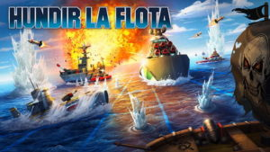

  

----------

🚢 **Hundir la Flota - ¡Demuestra tu estrategia naval!**

¡Bienvenido a Hundir la Flota, el clásico juego de batallas navales donde pondrás a prueba tu estrategia y puntería! 🎯⚓

🎮 **¿En qué consiste el juego?**

Hundir la Flota (también conocido como Batalla Naval o Battleship) es un juego en el que dos jugadores colocan sus barcos en un tablero de forma estratégica. El objetivo es hundir todos los barcos del oponente antes de que él hunda los tuyos.

🛳️ **Reglas básicas:**

- Cada jugador coloca su flota en un tablero de X filas por Y columnas (según configuración del juego).

- Los barcos pueden ocupar varias casillas en posición horizontal o vertical.

- Los jugadores se turnan para disparar en una coordenada específica (ej. "0,1").

Si el disparo acierta en un barco, se marca como tocado (X); si acierta en todas las partes de un barco, este se considera hundido (Z).

El primer jugador en hundir toda la flota enemiga gana la partida. 🏆

📂 **¿Qué encontrarás en este repositorio?**

Este repositorio contiene el código fuente de Hundir la Flota, incluyendo la lógica del juego y las reglas implementadas.

📜 **Estructura del proyecto:**

utils/ → Código funciones del programa.

main/ → Código para ejercutar juego.

README.md → Este archivo, que explica el propósito del repositorio.

🚀 **¿Cómo jugar?**

Clona este repositorio:

git clone https://github.com/Krvelez92/Proyecto_Hundir_Flota.git

Accede al directorio del juego:

cd Proyecto_Hundir_Flota

Ejecuta el juego:

py main.py

**¡Disfruta de la batalla naval!** 🔥

**¡Gracias por jugar y contribuir a Hundir la Flota!** 🚢🔥

